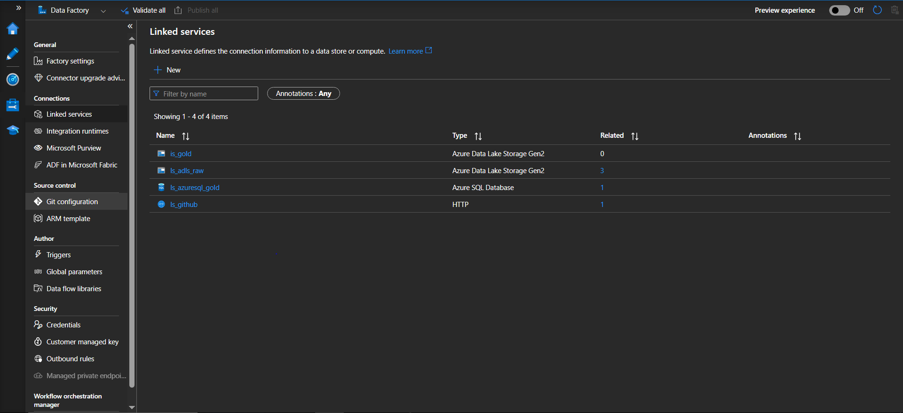
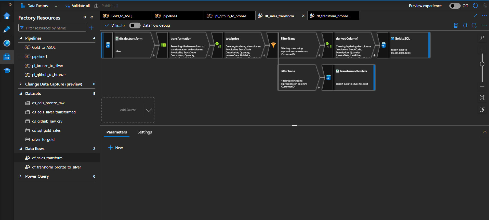
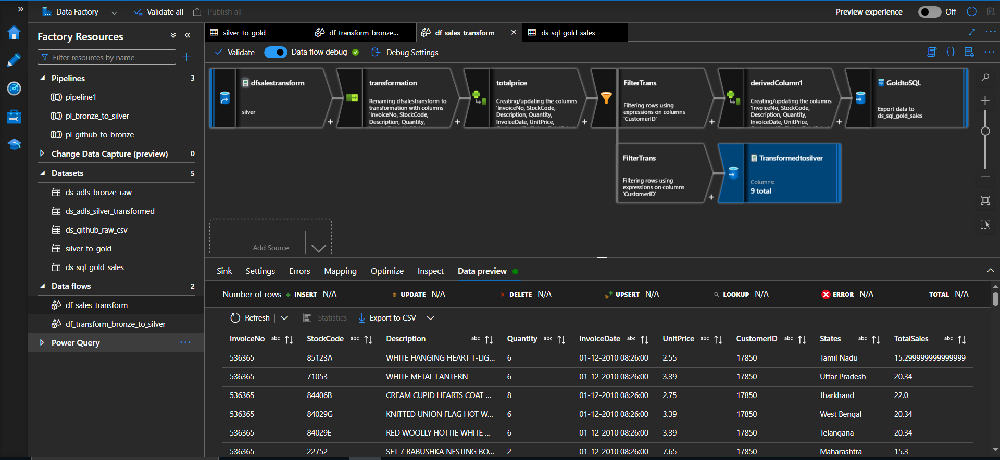
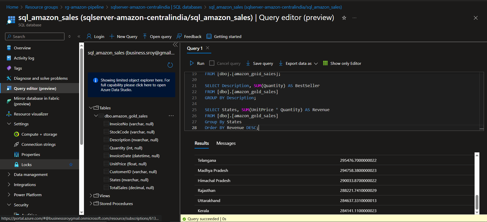
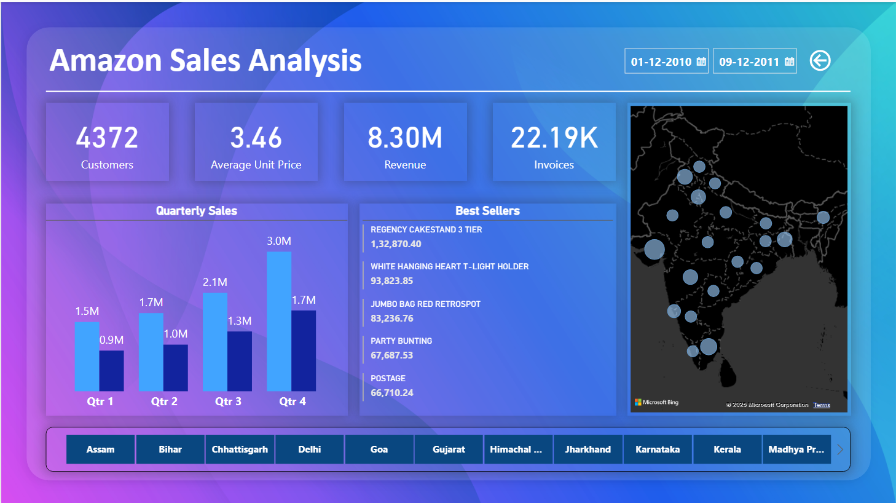

# Amazon Sales Analysis - Azure ETL Project

This project showcases a complete end-to-end ETL and BI reporting pipeline using Microsoft Azure services, GitHub, and Power BI, following the **Medallion Architecture (Bronze-Silver-Gold layers)** for structured data management.

---

## 🚀 Project Overview

- **Source**: GitHub (raw CSV file: `raw_sales.csv`)
- **Goal**: Transform and analyze Amazon store sales data using Azure-native tools
- **Tech Stack**: GitHub, Azure Data Factory (ADF), Azure Data Lake Storage Gen2 (ADLS), Azure SQL Database (ASQL), Power BI

---

## 🗂️ Project Architecture

```
GitHub Repo
   └── Azure Data Factory
         ├── Ingest to Bronze Layer (ADLS)
         ├── Transform via Data Flow (Silver Layer)
         ├── Cleaned Data moved to Gold Layer
         └── Sink to Azure SQL Database
                  └── Connected to Power BI
```

---

## 🔧 Components & Services

### 1. Azure Resource Group

- **Name**: `rg-amazon-pipeline`
- Central place to manage and monitor all Azure resources

### 2. Azure Data Lake Storage (ADLS Gen2)

- **Name**: `adlsamazondatalake`
- **Containers**:
  - `bronze/` : Raw data from GitHub
  - `silver/` : Cleaned/transformed data
  - `gold/` : Final curated data for reporting

### 3. GitHub (Data Source)

- **File**: `raw_sales.csv`
- Pulled via HTTP linked service into ADF

### 4. Azure Data Factory (ADF)

- **Pipelines**:
  - `pl_github_to_bronze`
  - `pl_bronze_to_silver`
  - `pl_silver_to_gold`
- **Data Flows**:
  - `df_sales_transform` (date conversions, null handling, formatting)
- **Linked Services**:
  - GitHub (HTTP)
  - ADLS Gen2
  - Azure SQL Database
- **Datasets**:
  - GitHub source (CSV)
  - Bronze, Silver, and Gold layer files
  - SQL Table sink

### 5. Azure SQL Database

- **Server**: `sqlserver-amazon-centralindia`
- **Database**: `sql_amazon_sales`
- Table for curated data
- Used for Power BI reporting

### 6. Power BI

- Connected to Azure SQL DB
- **Dashboard: Amazon Sales Analysis**
  - KPIs: Total Sales, Total Customers, Total Invoices, Avg. Item Value
  - Bubble Map: Revenue by States
  - Bar Chart: Quarterly Revenue & Quantity
  - Table: Top 5 Items by Revenue
  - Slicers: Date Range and 20 States

---

## 📷 Screenshots Included

- Azure Resource Group

- ADLS with Bronze/Silver/Gold folders

- ADF Linked Services

- ADF Pipelines and Data Flows


- Azure SQL DB & Queries

- Final Power BI Dashboard


---

## 🧠 Key Learnings

- Implemented Medallion Architecture with ADLS
- Created dynamic pipelines and transformations using ADF Data Flows
- Handled date/time formatting issues in CSV
- Used Azure SQL DB as a curated reporting sink
- Built an interactive Power BI Dashboard linked to Azure SQL

---

## 📁 Repository Structure

```
amazon-sales-analysis/
├── data/
│   └── raw_sales.csv
├── documentation/
│   ├── architecture_diagram.png
│   ├── *.png (ADF, LS, Dataset, SQL screenshots)
├── pipelines/
│   ├── pl_github_to_bronze.png
│   ├── pl_bronze_to_silver.png
│   └── pl_silver_to_gold.png
├── dataflows/
│   └── df_transformations.png
├── sql_scripts/
│   └── mysql.sql
├── powerbi/
│   └── ASQL_PBI.pbix
└── README.md
```

---

## ✍️ Author

**Subhankar Roy**  
